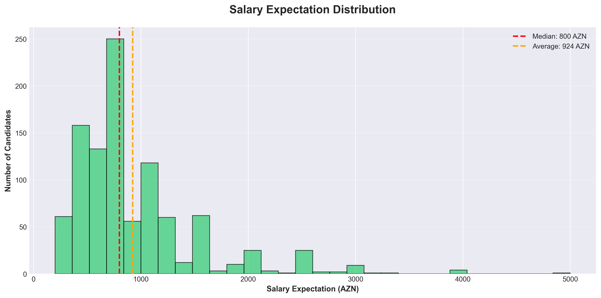
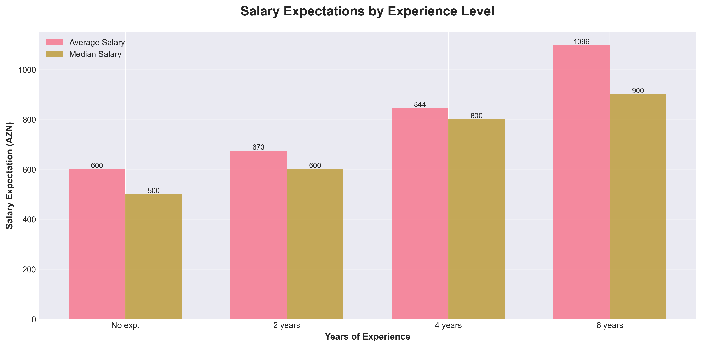
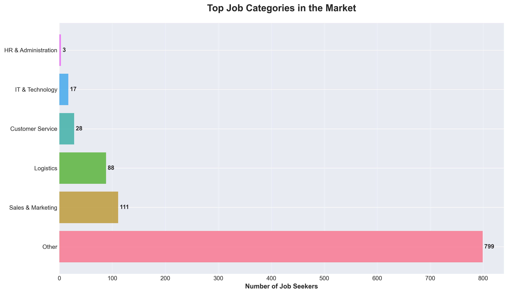
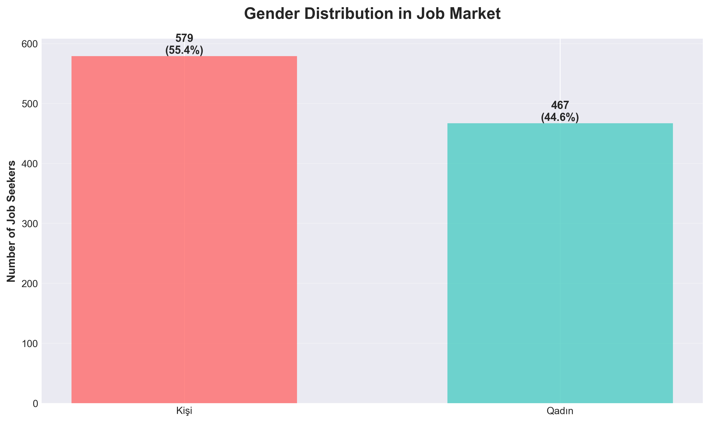
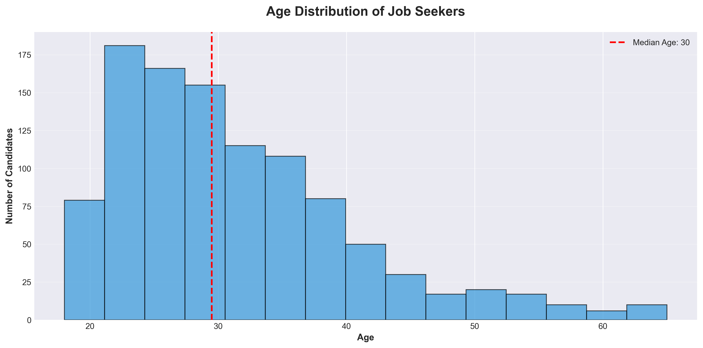
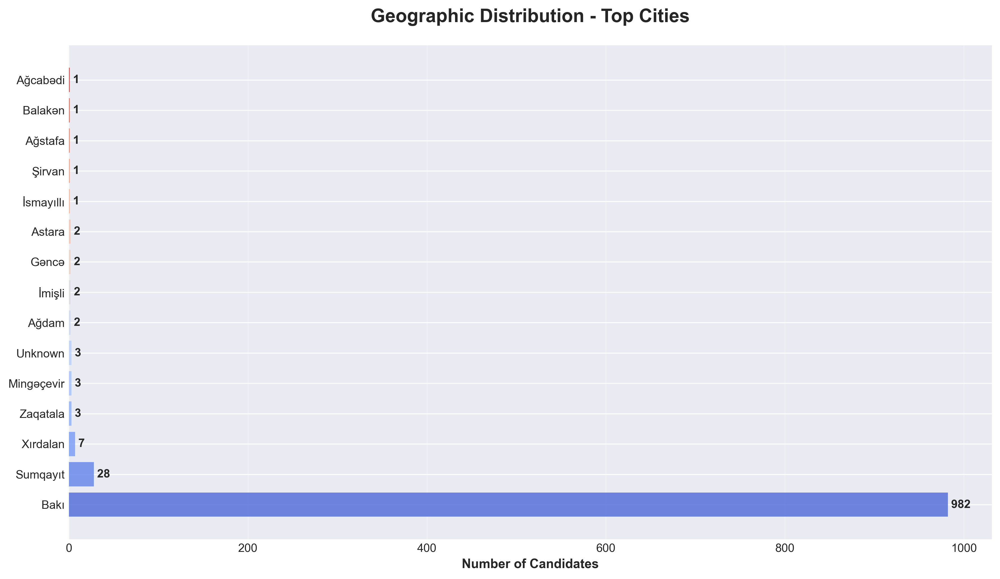
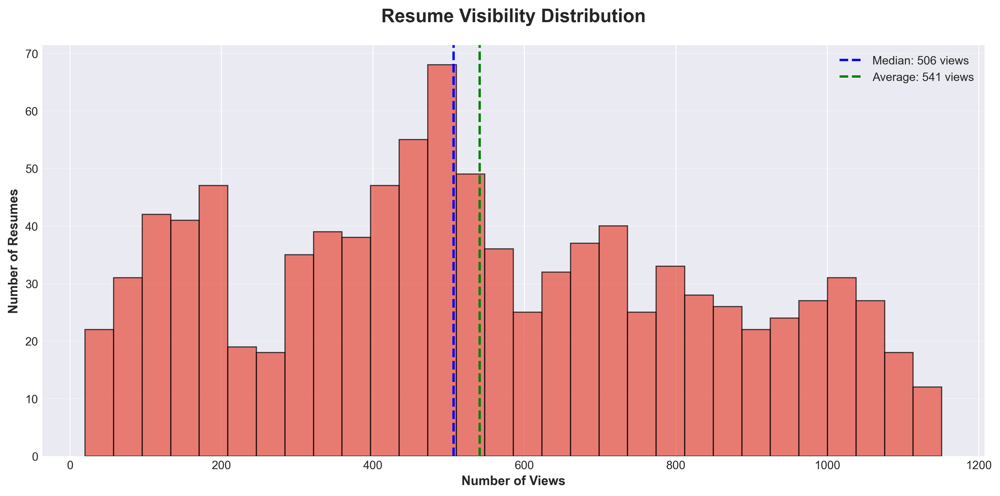
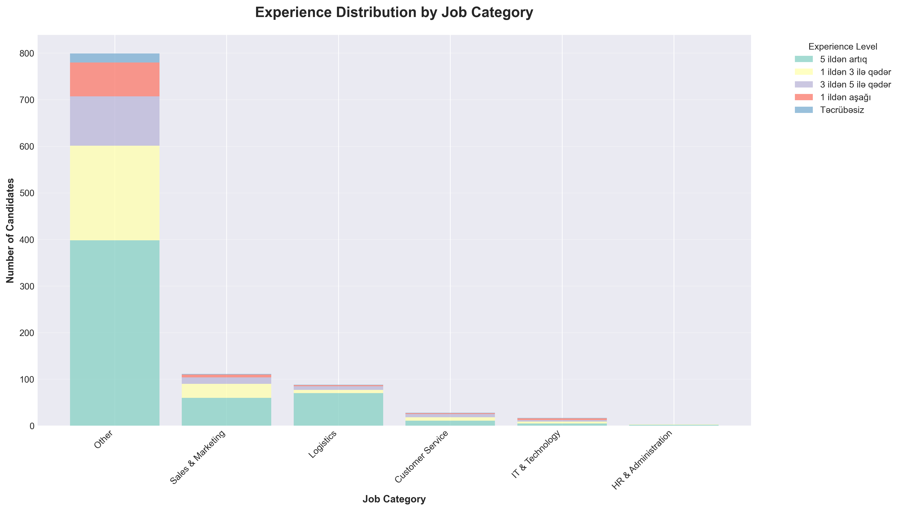

# Azerbaijan Job Market Intelligence Report
## Executive Analysis of Boss.az Platform Data

---

## Executive Summary

This report analyzes **1,046 active job seeker profiles** from the Boss.az platform, providing strategic insights into Azerbaijan's employment market. The findings reveal critical patterns in talent availability, salary expectations, and workforce demographics that can inform hiring strategies, compensation planning, and market positioning.

**Key Market Indicators:**
- **Active Talent Pool:** 1,046 qualified candidates
- **Market Concentration:** 94% concentrated in Baku metropolitan area
- **Median Salary Expectation:** 800 AZN
- **Experience Profile:** 52% of candidates have 5+ years of experience

---

## 1. Talent Market Overview

### What the Data Shows
The current active job seeker pool demonstrates a mature workforce with significant professional experience. Over half of all candidates (52.2%) have more than 5 years of professional experience, while only 2.2% are entry-level candidates without prior work history.

### Business Impact
**Strategic Hiring Advantage:** Organizations seeking experienced professionals will find a favorable market with substantial talent availability. However, companies looking to build junior teams or graduate programs face a limited candidate pool, suggesting potential need for:
- Investment in training and development programs
- Partnership with universities for early talent pipeline
- Competitive positioning for entry-level roles

**Action Item:** Consider experience requirements carefully when defining roles - the market heavily favors mid-to-senior level positions.

---

## 2. Compensation Landscape

### What the Data Shows
Salary expectations across the market show a median of **800 AZN** with an average of **903 AZN**. The distribution reveals that most candidates cluster around the 600-1,200 AZN range.

### Business Impact
**Budget Planning Insight:** The gap between median (800 AZN) and average (903 AZN) indicates that while most candidates have moderate salary expectations, a segment commands premium compensation. This presents opportunities for:

- **Cost-Effective Hiring:** Many qualified candidates are available within the 700-900 AZN range
- **Competitive Differentiation:** Organizations offering 1,000+ AZN can position themselves in the top tier
- **Experience Premium:** Clear correlation exists between years of experience and salary expectations, enabling structured compensation frameworks

**Financial Planning:** For a team of 10 mid-level hires, budget allocation should target 8,000-10,000 AZN monthly payroll to remain competitive without overpaying.

---

## 3. Sector Demand Analysis

### What the Data Shows
The job seeker market shows significant concentration in specific sectors, with Sales & Marketing and Logistics representing the most clearly defined categories after general positions.

### Business Impact
**Market Supply Dynamics:**

1. **Sales & Marketing Talent:** 111 candidates (10.6% of market) indicates strong availability for commercial roles
   - *Opportunity:* Build or expand sales teams with favorable supply
   - *Risk Mitigation:* High supply may indicate competitive market requiring strong employer branding

2. **Logistics Professionals:** 88 candidates (8.4% of market) reflects growing sector importance
   - *Strategic Note:* Critical for e-commerce, distribution, and supply chain operations
   - *Market Signal:* Growing logistics workforce suggests infrastructure development

3. **Technology Gap:** Only 1.6% IT professionals in active job seeking
   - *Talent Scarcity:* Technology hiring will be competitive and may require premium compensation
   - *Alternative Strategy:* Consider upskilling programs or remote hiring from broader markets

**Sector Positioning:** Organizations in sales-driven or logistics-dependent businesses will find abundant talent. Technology companies should prepare for competitive recruitment processes.

---

## 4. Workforce Demographics

### Gender Distribution

### What the Data Shows
The job-seeking population shows a relatively balanced gender distribution with 55.4% male and 44.6% female candidates, indicating broad workforce participation across genders.

### Business Impact
**Diversity & Inclusion Opportunity:** The near-equal gender distribution in the active job market enables organizations to:
- Build balanced teams without supply constraints
- Meet diversity targets organically through normal hiring processes
- Develop inclusive employer branding that appeals to both demographics

**Market Signal:** Gender balance in job seeking suggests cultural shift toward inclusive workforce participation, particularly beneficial for organizations with diversity mandates.

---

### Age Demographics

### What the Data Shows
The workforce shows a median age of **29 years** with average of **31 years**, indicating a predominantly young to mid-career talent pool. The distribution peaks in the 25-35 age range.

### Business Impact
**Workforce Characteristics:**

1. **Energy & Adaptability:** Young workforce typically brings:
   - Higher adaptability to new technologies and processes
   - Longer potential tenure and career development runway
   - Cost advantages (lower salary expectations at early career stages)

2. **Career Growth Expectations:** This demographic typically values:
   - Professional development opportunities
   - Clear advancement pathways
   - Modern workplace culture and benefits

**Retention Strategy:** Organizations should invest in career development programs and advancement opportunities to attract and retain this career-focused demographic.

---

## 5. Geographic Concentration

### What the Data Shows
An overwhelming **94% of all candidates are based in Baku**, with minimal presence in other cities (Sumqayit 2.7%, all others under 1%).

### Business Impact
**Location Strategy Implications:**

**For Baku-Based Organizations:**
- Abundant local talent eliminates need for relocation costs
- Competition for candidates is concentrated in one market
- Employer branding efforts should focus on Baku metropolitan area

**For Regional Operations:**
- Severe talent scarcity outside Baku (6% of total market)
- Regional offices may require:
  - Premium compensation to attract relocation
  - Remote work options for Baku-based talent
  - Local training and upskilling programs
  - Investment in employer housing or relocation benefits

**Expansion Planning:** Companies planning regional expansion should account for talent acquisition challenges and budget for relocation incentives or alternative staffing models.

---

## 6. Education & Qualification Levels

### What the Data Shows
The market demonstrates a highly educated workforce with substantial higher education credentials across the candidate pool.

### Business Impact
**Talent Quality Indicators:**

1. **Skilled Workforce Availability:** High education levels enable:
   - Faster onboarding and reduced training costs
   - Higher capacity for complex role responsibilities
   - Stronger foundation for upskilling initiatives

2. **Premium Positioning:** Organizations can:
   - Set higher qualification requirements without restricting candidate pool
   - Build knowledge-based competitive advantages
   - Reduce dependency on extensive training infrastructure

**Hiring Standards:** The educated talent pool supports maintaining high hiring bars without extending time-to-fill metrics.

---

## 7. Resume Visibility & Candidate Engagement

### What the Data Shows
Resume view counts reveal significant variation in candidate visibility, with most profiles receiving moderate attention while some attract substantially higher employer interest.

### Business Impact
**Candidate Quality Signals:**

The visibility distribution provides insights for recruitment efficiency:

1. **High-Visibility Candidates:** Profiles with view counts significantly above median indicate:
   - Strong market demand for specific skill sets
   - Well-optimized profile presentation
   - Potentially higher competition from other employers
   - May require faster decision-making to secure talent

2. **Undiscovered Talent:** Candidates with lower visibility may represent:
   - Opportunity for competitive hiring before market saturation
   - Recent profile creation (timing-based visibility)
   - Potential negotiation advantages
   - Need for profile improvement (may indicate less market awareness)

**Recruitment Strategy:** Prioritize reviewing both high-visibility candidates (market-validated skills) and promising lower-visibility profiles (less competition) for balanced talent acquisition.

---

## 8. Experience Distribution Across Sectors

### What the Data Shows
Different job categories show varying experience level distributions, revealing workforce maturity by sector.

### Business Impact
**Sector-Specific Talent Planning:**

Understanding experience distribution by sector enables:

1. **Realistic Hiring Timelines:**
   - Sectors with junior talent availability: Faster hiring cycles possible
   - Senior-heavy sectors: Extended search times, higher compensation required

2. **Team Building Strategies:**
   - Identify sectors where building mixed-experience teams is feasible
   - Plan mentorship structures based on available experience ratios
   - Adjust job requirements to match realistic market availability

3. **Competitive Positioning:**
   - Sectors with abundant experienced talent: Focus on differentiation beyond experience
   - Junior-scarce sectors: Develop training programs as competitive advantage

**Practical Application:** When building sector-specific teams, align role definitions with actual market experience availability rather than idealized requirements.

---

## Strategic Recommendations

Based on comprehensive analysis of the job market data, we recommend the following strategic actions:

### Immediate Actions (0-30 days)

1. **Compensation Benchmarking**
   - Review current salary structures against market median (800 AZN) and average (903 AZN)
   - Identify roles where compensation is below market to prevent attrition
   - Adjust offer ranges for open positions to competitive levels

2. **Geographic Strategy Assessment**
   - For Baku-based operations: Leverage abundant local talent pool
   - For regional needs: Develop remote work policies or relocation packages
   - Budget 15-20% premium for non-Baku positions to offset scarcity

3. **Technology Talent Plan**
   - Given 1.6% market share for IT roles, develop specialized recruitment strategy:
     - Premium compensation packages
     - Enhanced technical benefits
     - Remote work flexibility
     - Consider outsourcing or remote hiring from other markets

### Medium-Term Initiatives (30-90 days)

4. **Diversity & Inclusion Framework**
   - Leverage balanced gender distribution (55% male / 45% female) to:
     - Build diverse teams without supply constraints
     - Develop inclusive employer branding
     - Meet diversity objectives organically

5. **Experience-Based Hiring Strategy**
   - With 52% of market having 5+ years experience:
     - Focus mid-senior recruitment on abundant experienced pool
     - For junior roles, partner with universities and training programs
     - Develop clear career progression to attract young professionals (median age 29)

6. **Sector-Specific Campaigns**
   - Prioritize sales (111 candidates) and logistics (88 candidates) hiring with confident volume targets
   - Develop specialized value propositions for scarce categories
   - Create sector-specific employer branding materials

### Long-Term Strategic Planning (90+ days)

7. **Talent Pipeline Development**
   - Address entry-level shortage (2.2% of market) through:
     - University partnership programs
     - Internship and graduate schemes
     - Training academy for skill development
     - Consider this a competitive differentiator

8. **Regional Expansion Preparation**
   - For growth outside Baku (94% market concentration):
     - Build remote-first culture and infrastructure
     - Create attractive relocation packages
     - Develop regional training centers
     - Partner with local educational institutions

9. **Market Intelligence System**
   - Implement ongoing monitoring of:
     - Salary trend evolution
     - Candidate supply by category
     - Competitor hiring patterns
     - Seasonal activity cycles
   - Use insights for proactive workforce planning

### Risk Mitigation

10. **Competitive Positioning**
    - In markets with high supply (Sales, Logistics): Differentiate on culture and growth opportunity
    - In tight markets (IT, specialized roles): Lead with compensation and benefits
    - Monitor view count patterns to identify competitive pressure on key candidates

---

## Conclusion

The Azerbaijan job market, as reflected in Boss.az platform data, presents a **mature, educated, and experienced talent pool** concentrated in Baku. Organizations have access to:

- **Abundant experienced professionals** (52% with 5+ years experience)
- **Competitive salary environment** (median 800 AZN enables cost-effective hiring)
- **Balanced demographics** (near-equal gender distribution, young workforce)
- **High education levels** (reducing training overhead)

**Critical Success Factors:**

1. **Speed:** In a market with high visibility on strong candidates, move quickly
2. **Compensation Clarity:** Stay within or above the 800-900 AZN range for competitiveness
3. **Location Flexibility:** Embrace remote work given 94% Baku concentration
4. **Sector Awareness:** Adjust expectations by category - abundant in sales/logistics, scarce in technology
5. **Experience Matching:** Align roles to abundant mid-senior talent or invest in junior development

Organizations that align their talent strategies with these market realities will achieve:
- **Lower cost-per-hire** through market-informed offers
- **Faster time-to-fill** by targeting abundant categories
- **Higher quality hires** through educated candidate pool
- **Improved retention** via market-competitive compensation

The data indicates a **hiring-favorable environment** for most sectors, with strategic planning required only for technology roles and regional positions outside Baku.

---

## Appendix: Chart Reference

All business intelligence visualizations are available in the `/charts` directory:

- `01_salary_by_experience.png` - Compensation analysis by experience level
- `02_top_job_categories.png` - Market supply by job category
- `03_education_distribution.png` - Qualification levels in talent pool
- `04_gender_distribution.png` - Workforce gender balance
- `05_age_distribution.png` - Age demographics of job seekers
- `06_city_distribution.png` - Geographic concentration analysis
- `07_experience_distribution.png` - Experience level breakdown
- `08_salary_distribution.png` - Salary expectation patterns
- `09_view_count_analysis.png` - Candidate visibility metrics
- `10_salary_by_category.png` - Compensation by job category
- `11_experience_by_category.png` - Experience distribution by sector

---

**Report Generated:** December 2025
**Data Source:** Boss.az Resume Database
**Sample Size:** 1,046 Active Job Seeker Profiles
**Geographic Scope:** Azerbaijan National Market

---

*This report is intended for strategic planning and decision-making purposes. All insights are derived from anonymized, aggregated data analysis.*
